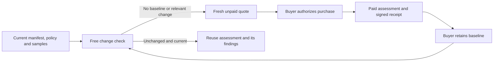

# Recheck Security Preflight when the inputs change

Security Preflight v1.2.0 is live. Connect the free change check to your own
release event or scheduler. It compares current supplied inputs with an
authentic stored assessment and tells your agent whether another scan is
needed. The check does not fetch or execute the deployed runtime.



## Try the free check

The client uses Python's standard library. No wallet or API key is required.

```bash
python3 scripts/viridis_preflight_watch.py \
  --inputs examples/security-preflight-inputs.json
```

With no baseline it returns `BASELINE_REQUIRED` and an exact unpaid quote
request. It does not buy or create an assessment. Replace the example with
your own manifest, policy, and samples before assessing a real integration.

After a buyer-authorized purchase through
`/x402/security-preflight/security_preflight`, save the complete response and
check again with current inputs:

```bash
python3 scripts/viridis_preflight_watch.py \
  --inputs current-inputs.json --paid-result paid-result.json
```

The helper checks local result and delivery-receipt digests before selecting
the baseline. These hashes establish file consistency, not independent
payment verification. The server verifies its own signed, persisted baseline.
Alternatively supply `--baseline-receipt-id vsr_<24 lowercase hex characters>`.

| Decision | Caller action |
|---|---|
| `BASELINE_REQUIRED` | Inspect the provided fresh quote request; apply the buyer's purchase mandate |
| `UNCHANGED` | Reuse the assessment, retaining its existing warnings or failed verdict |
| `RECHECK_REQUIRED` | Inspect changed fields or expiry/scanner reason, then obtain a fresh quote before any purchase |

The existing paid route retains its $1 list price and eligible introductory
offer. The current x402 v2 `PAYMENT-REQUIRED` header is authoritative. Scheduling
and payment authority belong to the buyer. Neither this helper nor the free
endpoint signs, pays, subscribes, or treats a static assessment as permission
to execute a tool.

## Direct HTTP and receipt discovery

Send `POST https://mcp.viridis-security.com/security-preflight/watch` with
JSON `{ "inputs": { ... }, "baseline_receipt_id": "vsr_..." }`; omit the
baseline on the first check. Unknown fields are rejected. Inputs bind the
agent ID, manifest, policy, sample contents, and optional profile digest.

Read a signed, input-redacted assessment at
`GET /security-preflight/receipts/{receipt_id}`. The response does not include
the private commercial feedback token. Unknown, corrupted, wrong-subject, or
unverifiable baselines cannot be used as a valid current assessment.

The [service contract](https://mcp.viridis-security.com/security-preflight/service.json),
[OpenAPI document](https://mcp.viridis-security.com/security-preflight/openapi.json), and paid
result's `viridis_commerce.change_check` expose this repeat path. Managed
recurring monitoring subscriptions are not activated by a free change check.

## Source and verification

The published [planner and HTTP factories](../gateway/preflight_watch.py) and
[Security Preflight core](../security-preflight-agent/src/core.py) match the
deployed release. The [integration patch](deployment/patches/agent-flywheel-b4515d26.patch)
records the exact changes to the private fleet's existing adoption and payment
integration and Docker copy list, against production base `b4515d26`.
Its `deploy/gateway` paths target that complete fleet source tree; it is not a
patch for the older public `gateway` reference or a standalone fleet image.
Most deterministic fleet cores remain private, as described in the README.

The private fleet regression passed 2,213 tests across 37 suites. Copied-state
rehearsal, production first boot, production restart, public discovery, and an
unpaid quote were verified. The [release receipt](deployment/AGENT_FLYWHEEL_RELEASE_2026-09-06.json)
records the image and file hashes. Verification did not create a payment or
claim customer adoption.

The public planner and client tests can be run with:

```bash
python3 -m pytest gateway/test_preflight_watch.py scripts/test_viridis_preflight_watch.py scripts/test_viridis_adoption_client.py -q
```

The planner tests require pytest, cryptography, Starlette, and httpx. Full
fleet integration tests additionally require the private fleet source tree.
