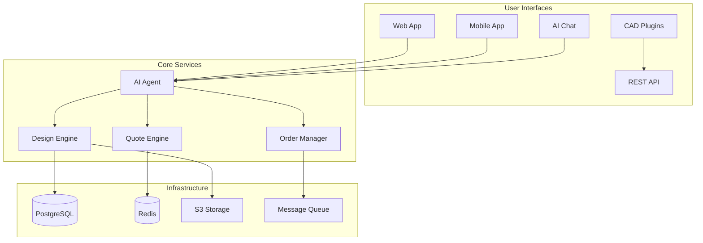

# ProtoGen 🏭🤖

## Viridis Revenue MCP CAD Agent

ProtoGen is the Viridis LLC CAD services agent. Its first deployable product is an MCP-callable CAD design environment that other agents can use to create a workspace, generate a parametric part design, export an OpenSCAD-style script contract, and hand the result into manufacturing planning.

Near-term revenue positioning:
- $99-$499 per CAD design brief or parametric part contract
- $500-$2,500/month workflows for makers, contractors, and product-development teams
- $3K-$15K/month custom CAD-to-manufacturing operations packages
- internal service layer for other Viridis agents that need CAD before quoting, building, or verifying work

The current code should be read as an MCP CAD design contract plus manufacturing-planning core, not yet a full end-to-end CAD platform.

<div align="center">
  
  
  [](https://opensource.org/licenses/MIT)
  [](https://github.com/protogen-ai/protogen/actions)
  [](https://codecov.io/gh/protogen-ai/protogen)
  [](https://discord.gg/protogen)
  
  **Transform ideas into manufactured products in days, not months.**
  
  [Website](https://protogen.ai) • [Documentation](https://docs.protogen.ai) • [API Reference](https://api.protogen.ai/docs) • [Blog](https://blog.protogen.ai)
</div>

## 🚀 Overview

ProtoGen is an AI-powered manufacturing platform that revolutionizes how products go from concept to reality. By combining advanced AI, a global supplier network, and seamless automation, we make manufacturing accessible to everyone—from individual makers to Fortune 500 companies.

### Key Features

- 🎨 **AI Design Assistant** - Natural language to CAD conversion
- 🔧 **Smart Manufacturing** - Automated process selection and optimization
- 💰 **Instant Quotes** - Real-time pricing from verified suppliers
- 📊 **Design Analysis** - DFM/DFAM validation and optimization
- 🌍 **Global Network** - 10,000+ verified manufacturing partners
- 📦 **End-to-End** - From design to delivered product

## 🏗️ Architecture



## 🚦 Getting Started

### Prerequisites

- Node.js >= 18.0.0
- Python >= 3.11
- Docker >= 24.0.0
- PostgreSQL >= 15.0
- Redis >= 7.0

### Quick Start

```bash
# Clone the repository
git clone https://github.com/protogen-ai/protogen.git
cd protogen

# Copy environment variables
cp .env.example .env

# Install dependencies
npm install
npm run bootstrap

# Start development environment
docker-compose up -d
npm run db:migrate
npm run dev
```

Your ProtoGen development environment is now running:
- 🌐 Web App: http://localhost:3000
- 🔌 API: http://localhost:8000
- 🤖 AI Agent: http://localhost:8001
- 📚 API Docs: http://localhost:8000/docs

## 🛠️ Development

### Project Structure

```
protogen/
├── apps/
│   ├── web/          # Next.js SaaS application
│   ├── api/          # FastAPI backend service
│   ├── agent/        # AI agent service
│   └── mcp-server/   # Model Context Protocol server
├── packages/
│   ├── ui/           # Shared React components
│   ├── core/         # Business logic
│   └── types/        # TypeScript definitions
├── infrastructure/   # IaC and deployment configs
└── docs/            # Documentation
```

### Available Scripts

```bash
# Development
npm run dev              # Start all services in dev mode
npm run dev:web         # Start only web app
npm run dev:api         # Start only API

# Testing
npm test                # Run all tests
npm run test:e2e       # Run end-to-end tests
npm run test:coverage  # Generate coverage report

# Building
npm run build          # Build all packages
npm run docker:build   # Build Docker images

# Code Quality
npm run lint           # Run ESLint
npm run format         # Format with Prettier
npm run typecheck      # TypeScript checking
```

### API Examples

#### Create a Project

```bash
curl -X POST https://api.protogen.ai/v1/projects/create \
  -H "Authorization: Bearer YOUR_API_KEY" \
  -H "Content-Type: application/json" \
  -d '{
    "name": "Custom Drone Frame",
    "description": "Lightweight racing drone frame",
    "requirements": {
      "dimensions": {"length": 250, "width": 250, "height": 50, "units": "mm"},
      "material_properties": ["lightweight", "strong"],
      "quantity": 10
    }
  }'
```

#### Get Manufacturing Quote

```bash
curl -X GET https://api.protogen.ai/v1/projects/PROJECT_ID/quote \
  -H "Authorization: Bearer YOUR_API_KEY" \
  -d '{
    "material_id": "carbon_fiber",
    "process": "cnc_milling",
    "quantity": 10
  }'
```

## 🤖 AI Agent Integration

ProtoGen's AI Agent can be integrated into any application using our MCP (Model Context Protocol) server:

```javascript
// Example: Using ProtoGen AI in your app
import { ProtoGenMCP } from '@protogen/mcp-client';

const client = new ProtoGenMCP({
  apiKey: process.env.PROTOGEN_API_KEY
});

// Natural language manufacturing
const result = await client.process({
  query: "I need 50 aluminum brackets, 2 inches L-shaped, with 4 mounting holes",
  action: "create_and_quote"
});

console.log(`Project created: ${result.projectId}`);
console.log(`Estimated cost: $${result.quote.totalCost}`);
console.log(`Lead time: ${result.quote.leadTimeDays} days`);
```

## 🧪 Testing

We maintain high code quality standards with comprehensive testing:

```bash
# Unit tests
npm run test:unit

# Integration tests
npm run test:integration

# E2E tests (requires running services)
npm run test:e2e

# Generate coverage report
npm run test:coverage
```

### Testing Guidelines

- Write tests for all new features
- Maintain >80% code coverage
- Use meaningful test descriptions
- Mock external services appropriately

## 🚀 Deployment

### Production Deployment

```bash
# Build production images
npm run build:prod

# Deploy to Kubernetes
kubectl apply -f infrastructure/kubernetes/

# Deploy with Terraform
cd infrastructure/terraform
terraform init
terraform plan
terraform apply
```

### Environment Variables

Key environment variables needed for production:

```bash
# Core Services
DATABASE_URL=postgresql://...
REDIS_URL=redis://...

# Authentication
JWT_SECRET=your-secret-key
OAUTH_PROVIDERS=google,github

# AI Services
OPENAI_API_KEY=sk-...
ANTHROPIC_API_KEY=sk-ant-...

# AWS Services
AWS_REGION=us-east-1
S3_BUCKET=protogen-designs

# Payment
STRIPE_SECRET_KEY=sk_live_...
```

See [`.env.example`](.env.example) for complete list.

## 📊 Monitoring

ProtoGen includes comprehensive monitoring:

- **Metrics**: Prometheus + Grafana dashboards
- **Logging**: Structured logs with Datadog
- **Tracing**: Distributed tracing with Jaeger
- **Errors**: Sentry error tracking

Access monitoring dashboards:
- Grafana: https://monitoring.protogen.ai
- Sentry: https://sentry.protogen.ai

## 🔒 Security

We take security seriously:

- 🔐 End-to-end encryption for design files
- 🛡️ SOC 2 Type II compliant
- 🔑 API key authentication with rate limiting
- 🚪 Role-based access control (RBAC)
- 📝 Comprehensive audit logging

Report security issues to: security@protogen.ai

## 🤝 Contributing

We love contributions! Please see our [Contributing Guide](CONTRIBUTING.md) for details.

### Quick Contribution Guide

1. Fork the repository
2. Create your feature branch (`git checkout -b feature/AmazingFeature`)
3. Commit your changes (`git commit -m 'Add some AmazingFeature'`)
4. Push to the branch (`git push origin feature/AmazingFeature`)
5. Open a Pull Request

### Development Setup

```bash
# Fork and clone your fork
git clone https://github.com/YOUR_USERNAME/protogen.git
cd protogen

# Add upstream remote
git remote add upstream https://github.com/protogen-ai/protogen.git

# Create a new branch
git checkout -b feature/your-feature

# Make your changes and run tests
npm test

# Submit a pull request
```

## 📚 Documentation

- **[User Documentation](https://docs.protogen.ai)** - Getting started guides and tutorials
- **[API Reference](https://api.protogen.ai/docs)** - Complete API documentation
- **[MCP Integration](https://docs.protogen.ai/mcp)** - AI agent integration guide
- **[Architecture Docs](./docs/architecture)** - System design and architecture

## 🗺️ Roadmap

### Q3 2025
- [ ] AR/VR design preview
- [ ] Blockchain supply chain tracking
- [ ] Advanced topology optimization
- [ ] Multi-language support (10 languages)

### Q4 2025
- [ ] Autonomous manufacturing cells
- [ ] Real-time collaboration features
- [ ] Advanced materials (composites, ceramics)
- [ ] ISO 27001 certification

### 2026
- [ ] ProtoGen Manufacturing OS
- [ ] Distributed manufacturing network
- [ ] AI-designed products marketplace
- [ ] Carbon-neutral manufacturing options

See our [public roadmap](https://github.com/protogen-ai/protogen/projects/1) for more details.

## 📈 Stats

<div align="center">
  
| Metric | Value |
|--------|-------|
| Total Projects Created | 1M+ |
| Manufacturing Partners | 10,000+ |
| Countries Served | 65 |
| Average Time to Quote | <60 seconds |
| Customer Satisfaction | 4.8/5.0 |
| Carbon Footprint Reduced | 30% avg |

</div>

## 🙏 Acknowledgments

- [OpenAI](https://openai.com) for GPT models
- [Anthropic](https://anthropic.com) for Claude
- [Three.js](https://threejs.org) for 3D visualization
- All our amazing [contributors](https://github.com/protogen-ai/protogen/graphs/contributors)

## 📄 License

This project is licensed under the MIT License - see the [LICENSE](LICENSE) file for details.

## 🏢 About ProtoGen

ProtoGen is revolutionizing manufacturing by making it accessible, efficient, and sustainable. We're backed by leading VCs and are rapidly growing our team.

**Join us in building the future of manufacturing!**

- 🌐 Website: [protogen.ai](https://protogen.ai)
- 💼 Careers: [protogen.ai/careers](https://protogen.ai/careers)
- 📧 Contact: hello@protogen.ai
- 🐦 Twitter: [@protogen_ai](https://twitter.com/protogen_ai)
- 💼 LinkedIn: [ProtoGen AI](https://linkedin.com/company/protogen-ai)

---

<div align="center">
  Made with ❤️ by the ProtoGen team
  
  ⭐ Star us on GitHub — it helps!
</div>
